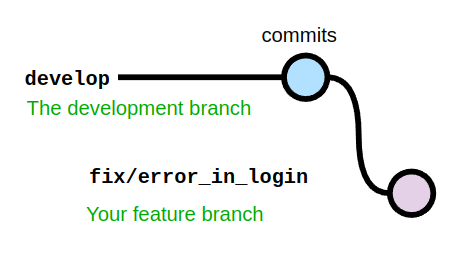
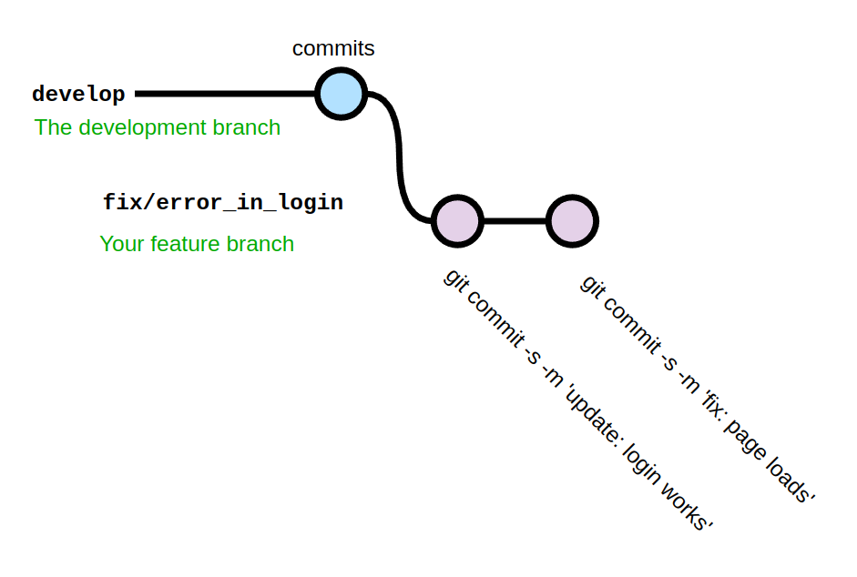
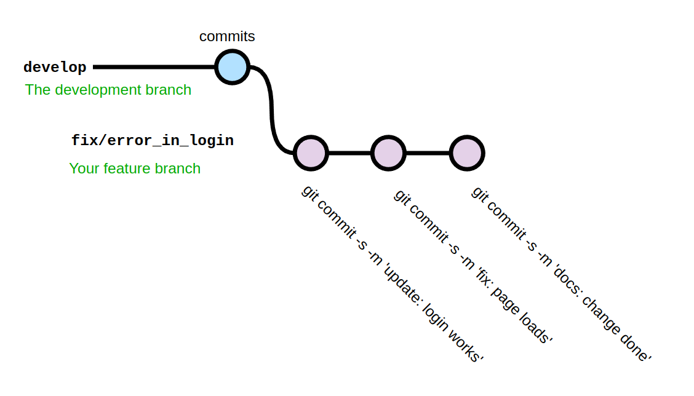
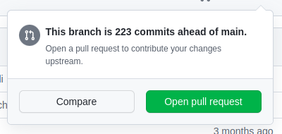
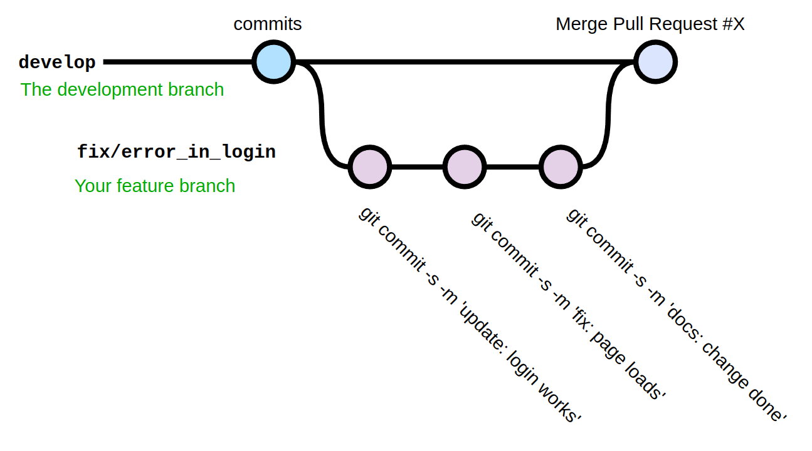
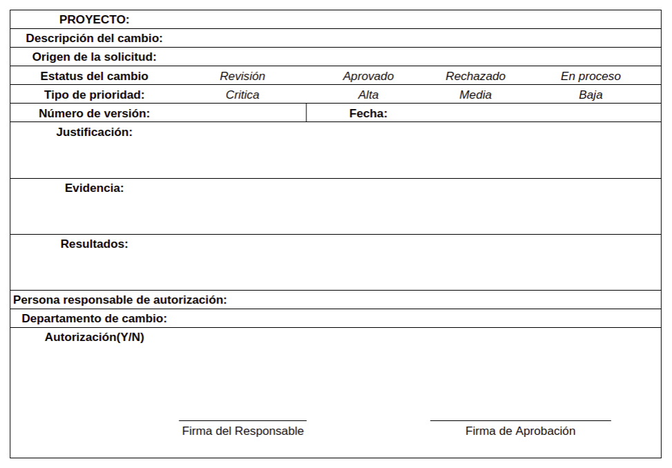
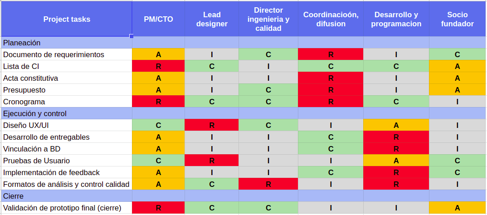

# Plan de Control de Cambios

## Contenido

1. Solicitudes de Cambio

    1. Formato de Solicitudes de Cambio

        1. Solicitudes de Cambio: Área de Programación

        2. Otras Solicitudes de Cambio

    2. Requerimientos
    
    3. Proceso de envío de una Solicitud de Cambio

2. Sistema de Integración de Cambios

    1. Matriz RACI: Responsabilidades del Equipo

    2. Responsabilidades del Change Control Board (CCB)

    3. Proceso de integración de cambios

## 1. Solicitudes de Cambio

Una solicitud de cambio es una propuesta formal para modificar cualquier documento, entregable o línea base del proyecto. Cambios en los ítems de configuración (CIs) se manejan bajo el [Plan de Configuración](). Cualquier otro cambio, se maneja bajo los procesos que se describen en el presente plan.

### 1.1. Formato de Solicitudes de Cambio

**1.1.1. Solicitudes de Cambio: Área de Programación**

Cambios que se realizan en el código fuente del proyecto o entregable son responsabilidad del equipo de desarrollo. Cualquier miembro del equipo de desarrollo puede realizar un cambio al código fuente, siguiendo los lineamientos a continuación. Sólo cambios aprobados se implementan en el código fuente.

El desarrollo del código fuente se realizará por parte de los miembros del equipo de desarrollo. El control de versiones se realizará con la herramienta de [Git]() y el host para el código fuente será [Github](): estas dos herramientas trabajan a la par por medio de ramas o versiones de código. El manejo de cambios del código fuente con las herramientas mencionadas se llevará a cabo de la siguiente manera:

- Existen dos ramas de código fuente aceptado: `master` y `develop`. Con esto, existen dos versiones preliminares del código fuente visible para todos los integrantes del equipo de desarrollo. 

    - Rama `master`: contiene código fuente aceptado para **producción**. El código presente en esta rama es aquel que representa el entregable final del proyecto. **Cambios a esta rama sólo se permiten para el líder del equipo de desarrollo**, provenientes de la rama `develop`.

    - Rama `develop`: contiene el código fuente aceptado para **testing**. Es aquella versión del código que se desarrolla y está lista para las pruebas automatizadas y de usuario. **Cambios a esta rama son permitidos para cualquier miembro del equipo de desarrollo**.

- Cualquier cambio que un miembro del equipo de desarrollo quiera hacer, debe seguir el siguiente procedimiento:

    - Dicho miembro deberá hacer uso de **Git** y posicionarse en la rama `develop` para crear una rama nueva que contendrá el nuevo código que se quiere arreglar. La rama que se crea debe llamarse siguiendo la nomenclatura: `<prefijo>/<breve_overview_de_la_rama>`, donde `<prefijo>` puede ser `fix`, de tratarse de un arreglo; `feature`, de tratarse de código que implemente una nueva funcionalidad; o `docs`, de tratarse de un cambio o actualización a la documentación del código. `<breve_overview_de_la_rama>` serán dos o tres palabras que describan lo que se pretende hacer, donde cada palabara se separa con guión bajo (_).

        

    - Una vez creada la rama, el miembro del equipo que desea hacer el cambio lo implementará localmente en dicha rama. Los *commits* a dicha rama deberán hacerse de la siguiente manera:

        ```
        git commit -s -m '<prefijo>: <msg>'
        ```

        donde `<prefijo>` puede ser `fix`, `update` o `docs`; y `<msg>` será una breve descripción del código que se está subiendo.

        

    - Cuando la acción que el miembro del equipo quiere implementar está terminada, deberá hacer un último *commit y push* a su rama local que lo indique. 

        
  
    - Después, deberá solicitar que su cambio sea incorporado a la rama `develop` por medio de un *Pull Request* usando [Github](), desde su rama a `develop`.

        

    - El *Pull Request* creado por el solicitante del cambio sólo podrá ser incorporado a la rama `develop` por medio de un *Merge* si se cumple lo siguiente:

        - Al menos 1 miembro del equipo (sin incluir al solicitante) debe hacer un *Code Review* y aprobar los cambios de la rama en cuestión.

        - La rama del solicitante no presenta *Merge Conflicts* sin resolver.

        - No hay conversaciones pendientes de responder en el *Pull Request* de Github.

        

    - Una vez incorporada la rama del solicitante a `develop`, la rama debe ser borrada por el solictante.

Con este proceso se lleva a cambio el control de integración de cambios al código fuente, y con el uso de las herramientas mencionadas queda documentada cada acción realizada, además de que analiza automáticamente las implicaciones de los cambios y los muestra como *Merge Conflicts*. Por lo tanto, éste es el sistema de control de la integración de cambios al código fuente y no se requieren acciones adicionales.

**1.1.2. Otras solicitudes de cambio**

Cualquier otro cambio que se desee hacer que no involucre código fuente deberá solicitarse por medio de una Solicitud de Cambio. Esta Solicitud tiene el siguiente formato:



Aclaraciones:

- *Proyecto*: nombre del proyecto. Siempre será el mismo.

- *Número de versión*: se deberá copiar el *Tag* de la versión del código en la que se está trabajando al momento de la solicitud de cambio, a fin de ubicar el cambio en la línea de desarrollo.

- *Estatus del cambio* y *Tipo de prioridad*: en estos dos campos, el solicitante deberá circular la opción que mejor describa su solicitud.

- *Firma de Aprobación*: este campo, sólo se firmará si la solicitud es aceptada.

### 1.2. Requerimientos

Una solicitud de cambio es requerida bajo las siguientes condiciones:

- El cambio es lo suficientemente grande como para impactar el trabajo de otro miembro del equipo: si el cambio sólo afecta el trabajo (del presente sprint) del solicitante, el cambio puede hacerse directamente sin necesidad de presentar una solicitud. Por otro lado, si se quiere hacer un cambio donde probablemente se afecte el trabajo de otro miembro en el presente sprint o en futuros sprints, o afectará el trabajo del solicitante en futuros sprints, es necesario llenar el formato de Solcitud de cambio y seguir con el proceso formal.

- El cambio debe de ser informado a otros departamentos: si el solicitante considera que su cambio no es lo suficientemente grande como para requerir una solicitud, pero considera que debe informarse a otros departamentos, es necesario llenar el formato de Solcitud de cambio y seguir con el proceso formal.

- El cambio debe de ser informado al departamento donde labora el solicitante: si el solicitante considera que su cambio no es lo suficientemente grande como para requerir una solicitud, pero considera que debe informarse al resto de su equipo, es necesario llenar el formato de Solcitud de cambio y seguir con el proceso formal.

### 1.3 Proceso de envío de una Solicitud de Cambio

Una vez que se determina que un cambio requiere de una Solicitud de Cambio, el proceso para que la misma entre al sistema de integración de cambios es el siguiente:

1. El solicitante debe llenar los campos del formato de la sección anterior, y firmarlo. El único campo pendiente será el de *Firma de Aprobación*.

2. El documento debe guardarse como pdf (escaneado o firmado digitalmente), para ser enviado al Project Manager **únicamente por correo electrónico**, a la dirección: 0197495@up.edu.mx.

3. Una vez que le ha llegado la solicitud al Project Manager, éste podrá reenviar dicha solicitud al socio fundador si considera que el cambio le compete.

4. Una vez en manos del Project Manager, éste deberá guardar el documento en el repositorio oficial del proyecto, a fin de que el historial de cambios se mantenga.

## 2. Sistema de Integración de Cambios

Los cambios a código fuente se integran mediante el proceso descrito en la Sección 1.1.1. Los otros cambios que requieren del formato de Solicitud de Cambio de la sección 1.1.2, una vez que éste ha sido enviado, entran al Sistema de Integración de Cambios. Este sistema se describe en las siguientes secciones.

### 2.1. Matriz RACI: Responsabilidades del Equipo

El Proyect Manager recibe la Solicitud de Cambio y, basándose en la matriz RACI a continuación, decide a quién se le informa, consulta o responsabiliza dicha solicitud según sea la etapa en la que se presente el cambio:



Donde:

- R: Responsible
- A: Accountable
- C: Consulted
- I: Informed

Una vez que se identifique a quién involucra en el cambio solicitado, se entra en la siguiente fase del sistema de integración de cambios.

### 2.2. Responsabilidades del Change Control Board (CCB)

El Change Control Board (CCB) es el comité de aprobación de una Solicitud de Cambio, y como tal, es la entidad responsable de aprobar o rechazar cambios. Está conformado por el Project Manager y los líderes de cada departamento del proyecto.

Como un cambio que requiere de una Solicitud de Cambio es, por definición, un cambio que impacta significativamente al proyecto, entonces los involucrados deben de incorporarse al CCB de ese cambio. Por lo tanto, una vez que el Project Manager identifica por medio de la matriz RACI quiénes son los involucrados en el cambio, deberá convocarlos como parte del CCB, si es que no son ya miembros.

Las responsabilidades del CCB ante una Solicitud de Cambio son:

- Cada miembro del CCB deberá analizar con su departamento correspondiente la propuesta de la Solicitud. 

- Cada miembro del CCB deberá preparar los costos, tiempo y recursos que el cambio involucraría en su departamento y redactarlo brevemente en un documento.

- Agendar una reunión donde todos los miembros del CCB estén presentes. Si es necesario, el Project Manager deberá invitar al socio fundador.

- Aprobar o rechazar la Solicitud de Cambio durante la reunión, basándose en los impactos que cada departamento plantea. Si la solicitud es aceptada, la sección del formato llamada *Firma de Aprobación* quedará firmada por el Project Manager. Éste también deberá reenviar el formato firmado al solicitante por correo electrónico.

- Si la Solicitud de Cambio es rechazada, el CCB deberá redactar un documento breve donde se explique la razón del rechazo. El Project Manager deberá enviarlo al solicitante por correo electrónico.

- Todos los documentos generados durante esta etapa de revisión de la solicitud deberán guardarse como parte del historial en el repositorio de documentos del proyecto.

### 2.3. Proceso de integración de cambios

Only approved changes should be incorporated into a revised baseline

Implementarlos: Tools

Documentos (PM Plan, Quality) updated:

- Activity List
- Assumption Log
- Lessons Learned Register
- Requirements Documentation
- Risk Register
- Stakeholder register