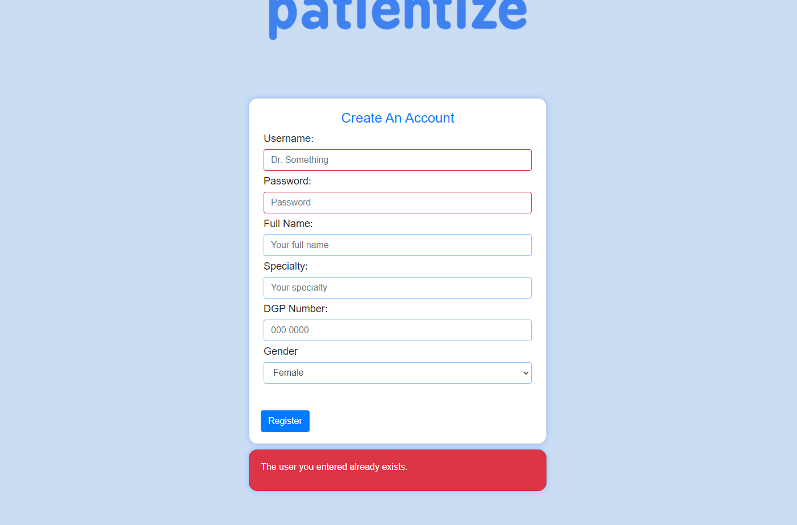
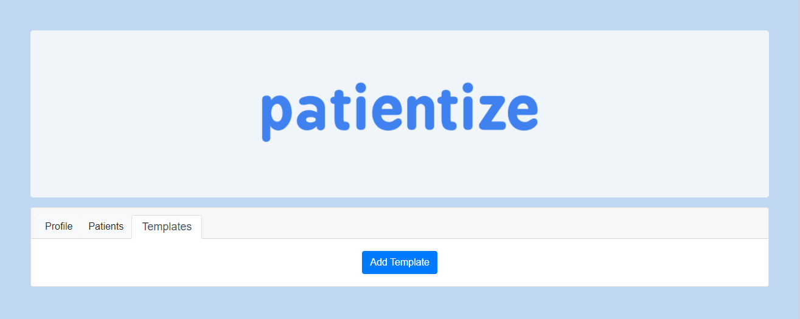
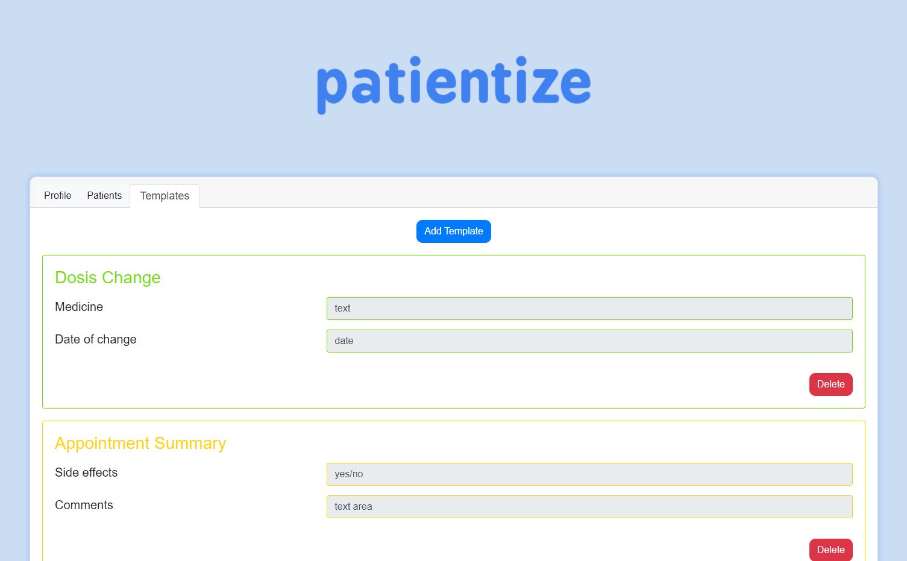
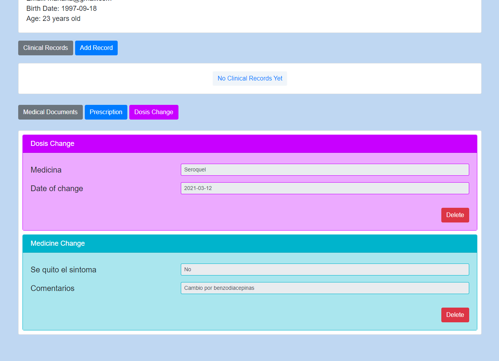
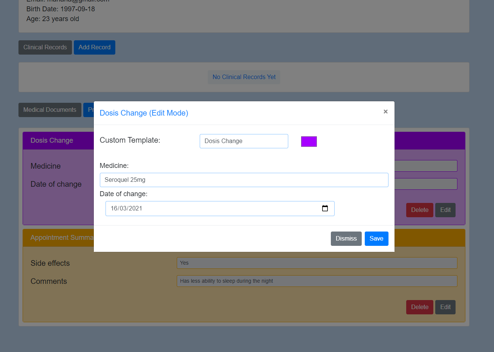
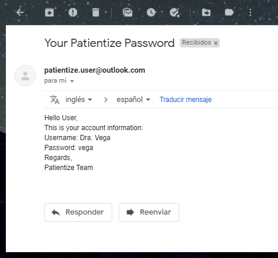

# Plan de Calidad

## 1. Política

Estamos comprometidos a proveer una solución web de alta calidad, mantenible, escalable y segura por naturaleza, para todos los médicos del mundo que deseen manejar la información de su trabajo en un entorno digital sencillo y fácil de entender.

## 2. Métricas

Lo que describe a un software a grandes rasgos es: ¿Cómo se ve? y ¿Cómo funciona? A continuación, se presentan las métricas para controlar la calidad de la solución web.

### 2.1 Funcionalidad Externa

#### 2.1.1 Aspecto

1. Login

La página cuenta con la vista usual de un login.

2. Registro

Cuando el usuario entra por primera vez y da click en el botón *Register* de la pantalla principal, se mostrará una pantalla para crear una cuenta, donde los datos obligatorios están encuadrados de rojo: Username y Password. Si al dar click en *Register* y el usuario que desea crear ya existe, se mostrará un letrero de error en rojo debajo del cuadro principal de registro.

2. Perfil

Después de que un usuario **exitente** se loggea, se observa la pantalla con el resumen de su perfil.

3. Templates

La página permite que el usuario personalice los formularios que usa frecuentemente con sus pacientes. Este proceso comienza en la pestaña de Templates.

- Crear un Template

    Si estando en la página anterior se le da clic al botón de Add Template, lo que aparece es lo siguiente, invitando al usuario a primero titular su nuevo Template. Por ejemplo, *Dosis Change* (Cambio de dosis), para aquel médico que debe mantener un control sobre cuándo y por qué cambia la dosis en sus pacientes.

    

    Para añadir un campo personalizado a un Template, se da clic en el botón de *Add Field*. Después, debe de nombrarse dicho campo y elegir el tipo de dato que almacenará: 

    - Fecha

    - Texto (una línea, tan larga como se desee)

    - Texto Largo (varias líneas, tan largas como se deseen)

    - Pregunta Sí/No

    Cuando se agrega un nuevo campo, el botón de *Add Field* se mueve de tal forma que siempre queda al final de todos los campos que se hayan seleccionado hasta el momento.

    Este proceso se repite tantas veces como se deseen campos en el Template. Adicionalmente, el usuario puede elegir un color para todos los templates de ese tipo, eligiendo un valor en la casilla cuadrada que muestra un color naranja en el ejemplo. Un Template 5 campos se vería de la siguiente manera:

    

    Al dar clic en *Save*, el Template queda guardado y está listo para usarse en pacientes.

    

- Usar el Template

    Cuando el usuario se mueva a la pestaña de Pacientes y de clic en *Add Patient*, un modal1 aparecerá sobre la pantalla con los campos a llenar:

    

    Este proceso se repetirá cuantas veces sean los pacientes que se tengan. La vista con la lista de los pacientes actuales se ve de la siguiente manera:

    

    El usuario, al poner el cursor **sobre** el nombre de algún paciente, y le dé click, se mostrará la vista de detalles del paciente: aquí es donde todos los Templates y documentos se resguardan por paciente. Por lo tanto, en la sección de *Medical Documents* aparecerá un botón naranja (color seleccionado en la sección anterior) que dice *Dosis Change*, que es el Template que se creó como ejemplo. Al dar click en este botón, el usuario ya puede llenar la información de los campos que seleccionó para su template y guardarlos como un documento en su paciente.

    

    Después de dar click en *Save*, un documento de *Dosis Change* se guarda en el paciente, donde la ficha es del color que eligió  en usuario para todas las fichas de tipo *Dosis Change*, con la finalidad de facilitar la búsqueda rápida de documentos.

    

- Borrar un Template

    Supongamos que un usuario tiene el Template *Dosis Change* en morado y *Medicine Change* en azul. Al hacer click en el botón *Delete* en la esquina inferior derecha del Template *Medicine Change*, ese Template será borrado y ahora en cada paciente ya no estará disponible el botón azul de *Medicine Change*. Sin embargo, todos los documentos de tipo *Medicine Change* hasta el momento seguirán guardados en los pacientes que los posean.

    

- Editar un Documento de algún Paciente

    Si el usuario se mueve a la vista de algún paciente, podrá elegir editar algún documento de ese paciente, haciendo click en la ficha que desee, en el botón gris *Edit* en la esquina inferior derecha. Aparecerá un modal1 sobre la vista actual con los datos previos de ese documento listos para editarse.

    

4. Recuperar Constraseña

Si el usuario no recuerda su contraseña establecida en la sección [Registro](https://github.com/the-other-mariana/pm/tree/master/PM1/project-planning/week4/res#Registro), puede dar click en el link en azul que dice *Forgot Your Password?*, llevándolo a la siguiente pantalla:

Luego, si el usuario ingresa el correo electrónico que vinculó con su cuenta, y da click en el botón *Send*, se le enviará un correo electrónico con su contraseña:

En caso de algún error al enviar el correo, se mostrará la siguiente pantalla:

Si el usaurio da click en *Ok*, será redireccionado a la página principal.

#### 2.1.2 Métricas

- Definición de Fallo

> Un fallo o defecto es inyectado en un software cuando un error ocurre en el proceso de desarrollo del sistema.

- Métricas de Calidad del Producto Final

    1. **Instrinsic Product Quality (IPQ) Metrics**: 
    
        1. **Defect Density Rate (DDR)**: es el número de bugs2 (Defectos Funcionales) que se registran al usar todas y cada una de las funcionalidades del sistema dividido entre el tamaño del sistema.

            $$
            DDR = \frac{\hbox{Número de bugs}}{LoC^3}
            $$

            Esta métrica deberá calcularse cada 5 bugs reportados, hasta que el software lleve 2 años de liberación.

        2. **Mean Time of Failure (MTTF)**: es la medida promedio de cuánto tiempo le toma al sistema fallar de forma fatal4.

        Por cada *bug* encontrado, se deberá calcular:

        3. **Probability of Failure**: la probabilidad de fallo asociado a un bug presente *i*, también llamado *bug size*.

            $$
            PoF_i = \frac{\hbox{Caminos con bug en una funcionalidad}}{\hbox{Total de caminos de la funcionalidad}}
            $$

    2. **Lines of Code Defect Rates**: 

        El LoC del sistema debe calcularse para el tamaño total del sistema, y cada que se calcule deberá reportarse como **LoC viejo (SSI)** y **LoC nuevo (CSI)**, refiriéndose al tamaño del sistema anterior y al tamaño después de la actualización más reciente: SSI por Shipped Source Instructions y CSI por Changed Source Instructions, ya que las LoC se miden por Source Instructions (instrucciones de código fuente).

        Reportar en cada *release*:

        - **SSI** y **CSI**.

        - **Defect Rate per Thousand SSI (KSSI)**:

        $$
        KSSI = \frac{bugs}{\hbox{Miles de SSI}}
        $$

        - **Defect Rate per Thousand CSI (KSSI)**:

        $$
        KCSI = \frac{bugs}{\hbox{Miles de CSI}}
        $$

        Y así calcular el **Número total de Defectos (DDR)**:

        $$
        DDR = KCSI \times KLoC
        $$

    3. **Customer Problems Metrics**:

        Desde el punto de vista del usuario, todos los problemas con los que se encuentran mientras usan el sistema, no sólo los **defectos válidos** (bugs), son problemas con el software. Incluso los problemas de usabilidad, documentación imprecisa, etc. 

        Reportar:

        - **Problems per User in a Month (PUM)**: el PUM es calculado cada mes después de que el software es liberado para el uso del mercado o usuarios selectos.

        $$
        PUM = \frac{\hbox{Customer problems}}{\hbox{Meses de uso}}
        $$

    4. **Defect Density During Testing**

        Las métricas de **DDR** aplicadas durante el proceso de desarrollo están correlacionadas positivamente con el DDR del release futuro.
        
        Reportar en cada *push*5 al código:

        $$
        DDR = \frac{\hbox{Número de bugs}}{LoC^3}
        $$

        Si el **DDR** durante el testing de desarrollo **es el mismo o menor que aquel DDR del release anterior**, entonces deberemos preguntarnos: ¿el testing para el release actual está deteriorando el producto futuro?

        | Métrica | Fitness Function6 | Significado |
        | ---- | ---- | ---- |
        | DDR | DDR actual <= DDR anterior | Seguimiento. Registrar el patrón de defectos que llegan (nuevos) al código fuente para identificar los tiempos entre fallas, de forma que los patrones indiquen la calidad por área desarollada.  |

        El objetivo es buscar estabilizar la llegada de nuevos bugs en un **nivel bajo y constante.**

    5. **Metrics for Maintenance**

        Mantenimiento de software:

        > Cuando el desarrollo de un producto de software está completo y éste es liberado al mercado, entra a la fase de mantenimiento en su ciclo de vida.

        Reportar:

        - **Llegada de defectos en intervalo de tiempo**: registrar los nuevos defectos funcionales y no funcionales (customer problems) en una serie de tiempo.

        - **Fix Backlog Index (FBI)**: el *Fix Backlog* es el número de bugs que se deben de arreglar como parte del mantenimiento. El *Fix Backlog Index* es el número de problemas reportados que **quedan al final de 1 semana**. Hacer una serie de tiempo.

        - **Backlog Management Index (BMI)**: sirve para manejar el backlog de problemas aún abiertos y no resueltos.

        $$
        BMI = \frac{\hbox{Número de problemas cerrados en 1 semana}}{\hbox{Número de nuevos problemas detectados en 1 semana}} \times 100\%
        $$

        | Métrica | Fitness Function | Significado |
        | ---- | ---- | ---- |
        | BMI | BMI > 100 | El backlog está siendo reducido y se llegará a cero. |
        | BMI | BMI < 100 | El backlog está aumentando y el mantenimiento sólo incrementará.
        | BMI | BMI = 100 | El backlog de mantenimiento siempre es constante. Cada nueva semana hay que arreglar el mismo número de problemas. |

        Realizr una serie de tiempo del BMI (gráfico de control).

        - **Fix Response Time**: es el tiempo límite que debe pasar para que la solución de un error deba estar disponible al público, en función de la métrica **PoF** para cada error *i*. El **Fix Response Time Metric** es el promedio de todos estos tiempos límite. 

        | Métrica | Fitness Function | Significado |
        | ---- | ---- | ---- |
        | FRT | FRT pequeña (1 día) | Pequeños FRT conduce a satisfacción del cliente. |

### 2.2 Funcionamiento Interno

----

modal1: es un componente de captura de datos muy utilizado en web, que básicamente es un cuadro sobrepuesto a la pantalla que lo desplegó, que oscurece la misma y sobrepone este cuadro con campos para llenar.

bugs2: en software, se le llama *bug* a un error o falla en la lógica del programador, que puede o no resultar en la interrupción del programa durante su ejecución.

LoC3: Lines of Code, es la medida estándar de un software.

Fallar de forma fatal4: en software, un fallo fatal es que el sistema se interrumpa de forma abrupta y definitiva.

push5: en software, un *push* es la acción de un desarrollador cuando añade el código que desarrolló al código fuente que es visible para todos los demás desarrolladores. Se recomienda hacer un *push* por cada funcionalidad completada.

Fitness Function6