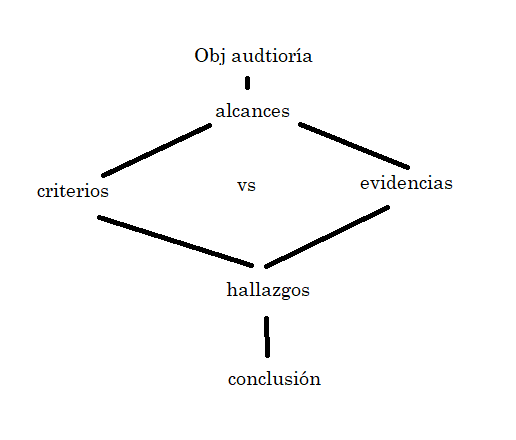

## Fases de la auditoría

1. **Planificación**: esta fase es para solicitar la auditoría y sea asignado como auditor por el auditado, es decir, te la solicitan. Se acuerdan las fechas y las partes que se auditarán. Se definen los ciclos de auditoría aquí y en preparación. Se define alcance, objeivos, Detalle de los departamentos, procesos o las empresas que serán auditadas, Personas que serán entrevistadas y sus agendamientos correspondientes.

- Solicitud de auditoría

- Acuerdo de fechas

- Asginación auditor

2. **Preparación**:  auditor líder asigna funciones y prepara la lista de chequeo

- Solicitud de requerimientos

- Envío de agenda

- Preparación de auditoría

3. **Realización**:  la mayor cantidad de versiones del informe involucrará cada vez más al auditado. Puede corregirte y decirte que sí hizo ciertas cosas. Se colecta toda la información, la evidencia, los testimonios y se realiza un informe con todos los hallazgos.

- Realización de auditoría

- Emisión de informe preliminar

- Emisión de borrador informe final

- Emisión informe definitivo

4. **Seguimiento**: se vuelve a alimentar el ciclo de la auditoría. La auditoría es en ciclos, vuelve a empezar. Se vuelve a ejecutar el ciclo, iteración. los auditores revisan los problemas encontrados y plantean las recomendaciones a seguir. Un plan de seguimiento que tenga la posibilidad de verificar que se estén cumpliendo las recomendaciones (vuelve a empezar).

- Comunicación de resultados al auditado

- Seguimiento Plan de Acción

- Actualización periódica de plan de acción

- Envío de planes de acción a promotores

Se pueden hacer auditorías por ciclos: un ciclo por stakeholder, ciclo de costos, un ciclo por paquete de trabajo (escaleras, pisos, etc)

Fuentes

- https://blog.softexpert.com/es/las-4-etapas-esenciales-en-auditorias-de-calidad/

- https://blog.kawak.net/es-mx/mejorando_sistemas_de_gestion_iso/tipos-y-fases-de-una-auditoria

## Roles y Responsabilidades de auditoría

1. **Auditor líder:** responsable de asegurar una conducta eficiente y efectiva de la auditoría de proyectos dentro de los alcances de la misma. 

    - alcance de calidad, alcance de costo, alcance de tiempo. Alcance son límites.

    - **eficiente:** q se realice extactamente con los recursos que se le asignó a la actividad.

    - **eficaz:** q se logre el objetivo. Fui eficaz (cumplí) pero no eficiente (me sobró tiempo).

2. **Auditor de proyecto:** (único) responsable de **recopilar y analizar** las evidencias del proyecto **relevantes y suficientes** para determinar los resultados de la auditoría del proyecto. 

No se trata de q los docs digan exactamente lo que dice tus req de auditoría. Recopilar no es tarea del auditado. Para que algo sea suficiente y relevante depende del objetivo de la auditoría, para que **te ayude al objetivo y resultados** de la auditoría.

3. **Experto técnico:** persona que aporta conocimientos específicos o experiencia al equipo auditado. Se requiere porque el auditor no necesariamente tiene q ser experto en el área q audita.

    1. Comité ejecutivo del proyecto: los que cubren la necesidades para llevar a cabo el proyecto. Ellos designan al:

    2. Director del proyecto: el que ejecuta y trae las riendas del proyecto. Después están:

        - Los q hacen el proyecto: responsable de las áreas o paquetes de trabajo. Son los expertos técnicos que hacen los paquetes de trabajo.

- Entre el DP y los q hacen el proyecto está el **PM**, q es el que gestiona:

    - Tiempo

    - Costo

    - Alcance

    - RRHH

    - puede tener un project manager en cada cosa q gestiona

- Hay proyectos donde el DP y el PM son la misma persona, pero las actividades son estructuradas de cada quien.

- El **Comité Eecutivo** le pide al auditor la auditoría.

- Ni el PM ni el auditor cruzan la línea entre el PM y los paquetes de trabajo. El auditor audita la **gestión del tiempo, alcance y recursos** (lo q getsiona el PM). Auditas la info q se genera de las actividades q salen de los paquetes de trabajo y por eso necesitas **experto técnico**.

4. **Auditado de proyecto:** Responsable de definir los objetivos de la auditoría de proyecto y proveer todos los recursos necesarios para la misma.

- Muchas veces se dice que se audita algo, pero si hay conflicto de intereses es una revisión.

- A excepción del rol de auditado, los roles pueden ejecutarse por la misma persona.

## Outputs de la auditoría

- **Alcance de la auditoría**: extensión y límites de una auditoría de proyectos. El alcance se define con el **objetivo de la auditoría**, definido por el **auditado**.

- **Criterios de la auditoría**: Conjunto de políticas o requisitos utilizados como referencia. Es contra qué te voy a comparar.

- **Evidencias de una auditoría**: todo donde se tenga registro. Registros, declaraciones de hechos u otra información que son **relevantes** para que los criterios de la auditoría sean verificables. Son **relevantes** si puedo comparar el criterio con esa evidencia. Todo es información del proyecto, pero no todas son evidencias (info relevante).

- **Hallazgos de auditoría**: resultados de la evaluación de las evidencias del proyecto frente a los criterios de la auditoría. Es el resultado de la comparación de criterios con las evidencias.

- **Conclusiones de auditoría de proyecto**: consecuencia de una auditoría de proyecto que debe contener acciones sugeridas derivados de los hallazgos de las mismas.

## Ejercicio

- Cada ciclo se dio del problema general a los particulares:

    - ciclo 1: encontrar la caja negra, pero lo pausan porque tarda su análisis.

    - ciclo 2: análisis de la torre de control.

    - ciclo 3: alarmas o advertencias

    - ciclo 4: intento final por salvar el avion, sus causas de que el klm.

- se combinaron errores humanos y fallas tecnicas. 

- Joan Jackson, asafata. recibio terapia.

- Jack ridout, rescató a 12 personas

Roles

| Nombre | Rol | Razon |
| --- | --- | --- |
| Bill Edmund (USA) | Auditor del proyecto | Asignado a revisión por parte de USA |
| Frans Erhart | Auditor del proyecto | Asignado a revisión por parte de Holanda |
| Velarde | auditor líder | Fue el responsable de llegar a la conclusion. |
| Patrick smith | experto técnico | Piloto experto en accidentes. |
| Asociación de pilotos | experto técnico | Le pregutan cosas técnicas y de perfil piloto | 
| Laboratorio de la universidad de washignton | experto técnico | analizó las cajas negras. |
| Accidente en terife | auditado |

- Conclusiones: el peor accidente de aviacion, se combinaron errores humanos y fallas tecnicas. Se sugiere que se implementen nuevas tecnologias para cubrir el problema de interferencias. Construccion de otro aeropuerto cerca del mar para evitar trafico aereo y niebla. **La pista estaba mal trazada (hallazgo) por lo que se debe construir otro aeropuerto (conclusion o sugerencia)**. Criterio vs evidencia = hallazgo. Sugerencia = conclusion.

- Objetivos: auditar causas del accidente.

- evidencias: tiene que ser útil para los resultados y objetivo de la auditoría

## Tarea