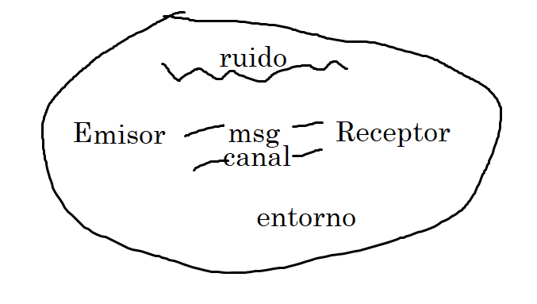

# Dictamen

Contenido mínimo del dictamen (presentado el sábado):

- **Nombre del proyecto**

- **Nombre de la auditoría del proyecto:** stá relacionado con el nombre, y contiene información de los objetivos, fechas, características, fases, etc.

    - Ej: auditoría de las primeras dos fases del proyecto tal

- **Fecha:** fecha oficial en el que se está **emitiendo el dictamen** (el día en el que lo envías). Será la misma? No, porque es el día en el que le entregas el dictamen.

- **Fecha de inicio y fecha de fin:** de la auditoría. De cuándo a cuándo realizamos la auditoría, para que se sepa en qué momento y contexto se hizo.

- **Patrocinadores:** (de la auditoría) quienes, ej. la UP, el profesor, etc. Cualquier persona física o moral que haya dado recursos para la auditoría, por lo tanto, quién la solicitó. El auditado cuenta.

- **Auditores:** experto técnico, auditor líder, etc.

- **Objetivos generales y específicos:** tanto del proyecto como de la porpia auditoría. Los objetivos de la auditoría dependen de los objetivos del proyecto? si el objetivo de la audit tiene que ver con los del proyecto, sí.

- **Descripción de actividades**: actividades que se hacen para la auditoría durante las fechas que se dijo. Clases, reuniones, 

- **Restricciones y limitaciones**: que la info estaba en whatsapp, que el auditado no nos dio esto, es muy poca, vacaciones. Restricciones a los que se enfrenta el equipo auditado. por que? porque este punto y la descripcion de actividades establece el **contexto** para las conclusiones.

- **Stakeholders de la auditoría:** cualquier persona física o moral que se ve afectada directa o indirectamente por el **resultado de la auditoría** (dictamen). Si no participa, no es.

----

- Un dictamen para ser dictamen debe ser formado y emitido (comunicado).

- Estilos de comunicación:

    - Visual: cuándo nos vemos? Escriben

    - Auditivas: cuándo platicamos? cuéntame. No le digas: te lo mando para que lo leas, porque no lo hará. Usan notas de voz.

    - Kinestesico (gestual): involucra los sentidos del tacto, gusto y olfato. Cuándo nos tomamos un café? usan stickers.

## Notas

- La comunicación indirecta comienza con el proceso y después llega al objetivo. Hablan el plural, por otros y a través de otros.

- La comunicación directa es el término personal, la controlan.

- Delfines: Soportan la comunicación, y es comunicación indirecta. AMLO (habla en plural a través de otros y por otros, indirecto)

- Pavorreales: Soportan la comunicación, pero es directo.

- Pantera: directo (abre la comunicación, individual), controlan la comunicación. Ronaldo.

- Búhos: comienza por el proceso (indirecto), soporta la comunicación.

### Ejercicio 

- Carlos de Aristegui Santos: singular (ya he llenado el formulario, he hecho esto, controla, no quiere llenar el formulario y se queja)

- Montse

    - habla sólo cuando le preguntan (soporta)

- Enrique León

    - soporta, ya que explica de los temas que surgen, y tiende a ser indirecto (habla primero con el proceso)

- Julio Quintana

    - Dirige la conversación (controla), es claro (contuemos). Pantera

- Nieves

    - habla poco y sólo cuando le preguntan (S), es directa (nos hemos creído que..). Buho.

- Ricardo ARcés

    - se queja, controla, y es directo (no quiero tener este mismo trabajo toda la vida)

 Narpáes

- Fernando 

    - Dirije y es claro 

    - directo (quiero ser así de claro), soporta (habla en plural)

| Nombre | Estilo | Razón | Cambió |
| --- | --- | --- | --- |
| Julio Quintana | Pantera | Habla de lo que él hizo primero con el punto y luego el proceso, y controla la conversación. | - |
| Enrique León | Búho | Controla pero de forma indirecta explicando | No |
| Nieves | Pantera | Habla en plural, pero soporta la conversación | No |
| Ricardo Arcés | Pantera | Controla la conversación y es directo al quejarse. | No |
| Ana Narpáes | Delfín | Ustedes se conocen? (habla por los otros), de forma indirecta | No (se mantuvo indirecta incluso al insultar, antes de que me echen, lo hace porque soy mujer o pq soy vieja? les da opciones) |
| Fernando | Pantera | No vota más que por el mismo | No | 
| Carlos | Pavorreal | Alza la pierna, habla de su CV. | Sí (Delfín) |

- C y S: C habla por sí mismo, y S habla por otros

- Delfín o búho: se define si habla en plural o singular.